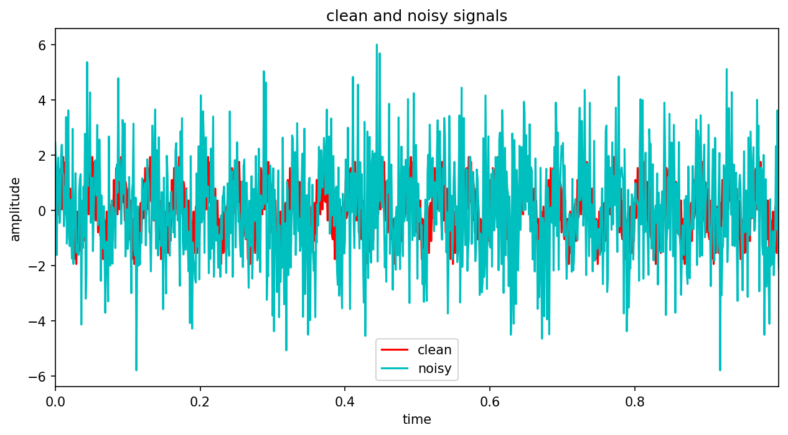
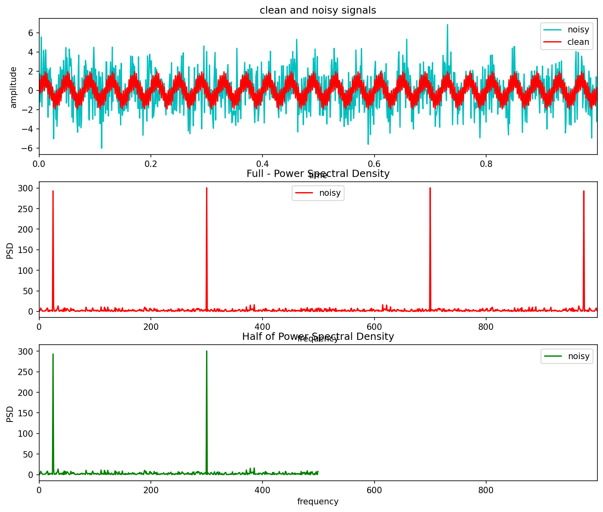
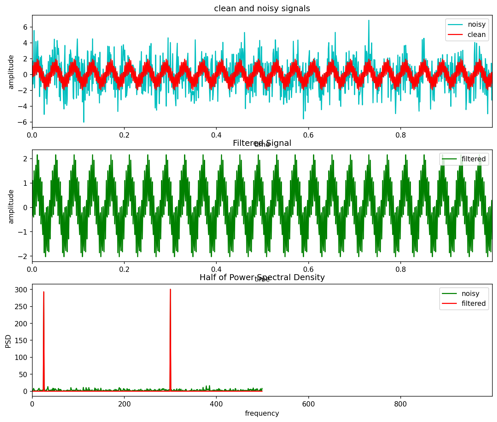

## Fast Fourier Transformation
  A fast algorithm that converts a signal from its time or space domain into its frequency components. In other words, a Fourier-transform converts a signal from its original domain (often time or space) to a representation in the frequency domain and vice versa.

## Key Applications
 1. Digital Communications   
 2. Audio and Image Processing   
 3. Medical Imaging
    
# **Analytical Method**
## **Table of Contents**
1. [Introduction](#introduction)
2. [Problem Statement: Noisy Signal Equation](#problem-statement-noisy-signal-equation)
3. [Transform to Complex Numbers (Fourier Computation)](#method-transform-to-complex-numbers-fourier-computation)
4. [Applied Power Spectral Density (PSD)](#applied-power-spectral-density-psd)


## **Introduction**
To filter a noisy signal analytically using the Fast Fourier Transform (FFT), you must map the time-domain signal into its complex number frequency components, apply a threshold filter, and map it back.

## **Problem Statement: Noisy Signal Equation**

<p align="center">
  
  <br>
  <em>Figure 1: Noisy signal</em>
</p>

Suppose you have a continuous time-domain signal \(x(t)\) composed of a clean \(50\text{ Hz}\) sine wave corrupted by high-frequency noise \(n(t)\):

```math
x(t)=\sin (2\pi \cdot 50\cdot t)+1.5\sin (2\pi \cdot 300\cdot t)
```

We sample this signal at a frequency $(\[f_{s}\])$ of $\(1000\text{ Hz}\)$ over $\[1\]$ second, yielding $\(N = 1000\)$ discrete data points: $\(x[0], x[1], \dots, x[N-1]\)$.

## **Method: Transform to Complex Numbers (Fourier Computation)**
The Fourier Computation mapped a time data into an array of complex numbers $\(X[k] = a_k + b_k i\)$, storing both the amplitude and the phase shift of every frequency.

<p align="center">
  
  <br>
  <em>Figure 1: Fast Fourier Transformation</em>
</p>


In fact, we pass the discrete sequence $\(x[n]\)$ into the Discrete Fourier Transform (DFT) equation to convert it into an array of complex numbers $\(X[k]\)$:

```math
X[k]=\sum _{n=0}^{N-1}x[n]\cdot e^{-i\frac{2\pi }{N}kn}
``` 
Using Euler's identity $(\(e^{-i\theta} = \cos\theta - i\sin\theta\))$, each frequency bin \[k\] is calculated as a complex number: 

```math
X[k]=a_{k}+b_{k}i
```

- $\mathbf{a_{k}}$ (Real part): Represents how much a cosine wave of frequency $\(f = \frac{k \cdot f_s}{N}\)$ matches the signal.
- $\mathbf{b_{k}}$ (Imaginary part): Represents how much a sine wave of that same frequency matches the signal. For instance, looking at the index corresponding to $\(50\text{ Hz}\) (\(k = 50\))$, the FFT outputs a large complex number:
 
```math
X[50]=24.03-480.45i
```

## **Applied Power Spectral Density (PSD)**
The PSD multiply the complex number by its own complex conjugate.

To find the real-valued power at a frequency, we must multiply the FFT output $\(X[k]\)$ by its complex conjugate $\(X^*[k] = a_k - b_k i\)$: 

```math
\text{PSD}[k]=\frac{X[k]\cdot X^{*}[k]}{f_{s}\cdot N}=\frac{(a_{k}+b_{k}i)(a_{k}-b_{k}i)}{f_{s}\cdot N}=\frac{a_{k}^{2}+b_{k}^{2}}{f_{s}\cdot N}
```

The Result: This strips away the imaginary unit $\[i\]$ and gives a completely real number representing the **pure power energy** at that frequency bin.

<p align="center">
  
  <br>
  <em>Figure 1: Clean Filtered Out Signal</em>
</p>

