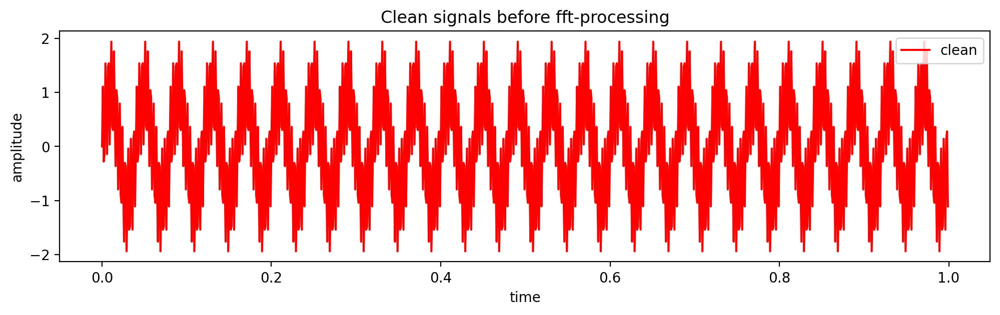
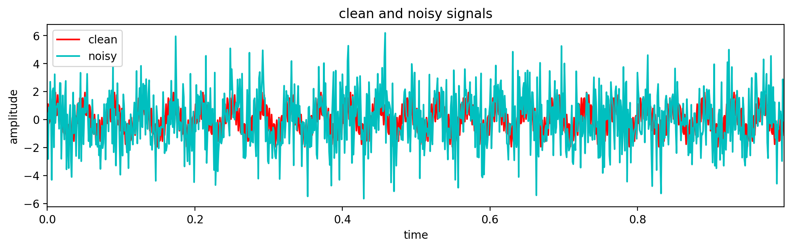
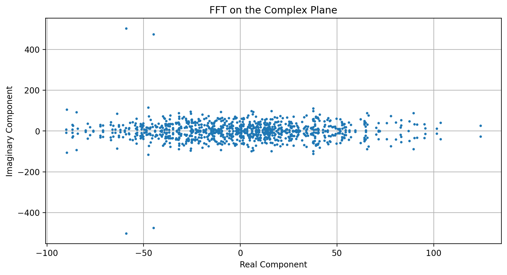
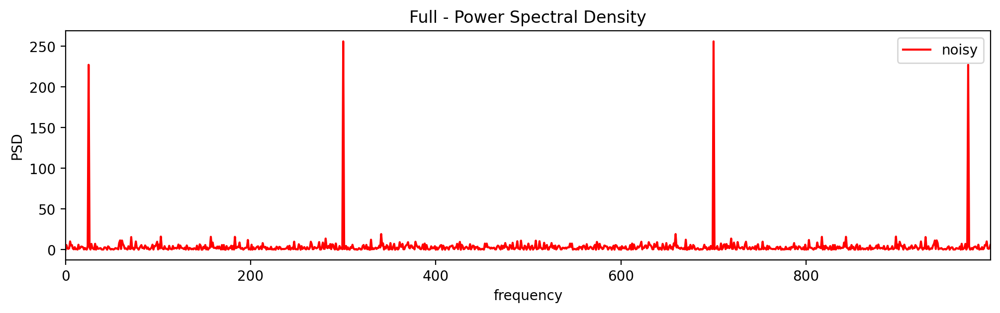
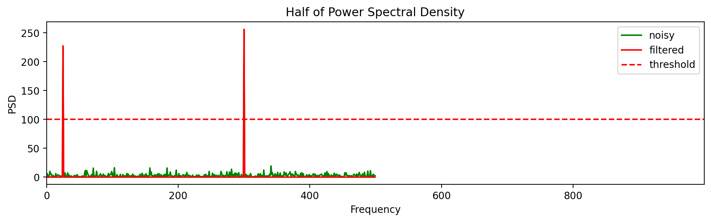
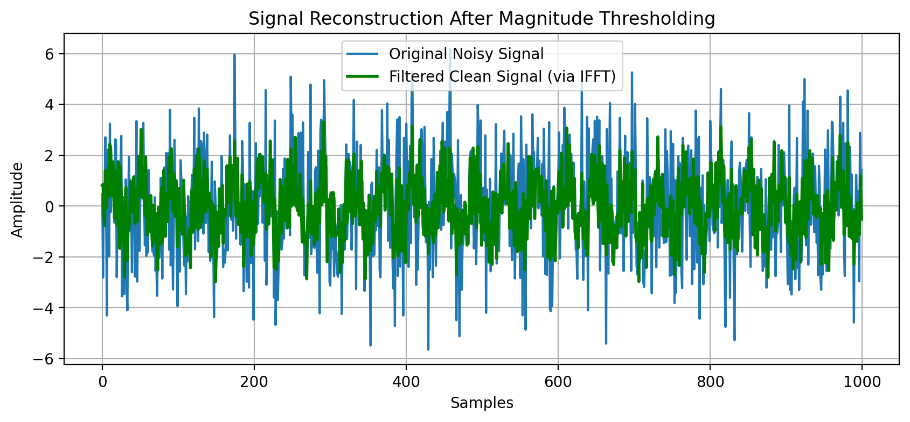
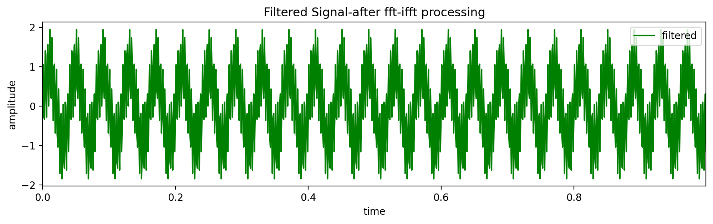

## Fast Fourier Transformation
  A fast algorithm that converts a signal from its time or space domain into its frequency components. In other words, a Fourier-transform converts a signal from its original domain (often time or space) to a representation in the frequency domain and vice versa.

## Key Applications
 1. Digital Communications   
 2. Audio and Image Processing   
 3. Medical Imaging
    
# **Analytical Method**
## **Table of Contents**
1. [Introduction](#introduction)
2. [Problem Statement: Noisy Signal Equation](#problem-statement-noisy-signal-equation)
3. [ompute the Fast Fourier Tansformation](#method-transform-to-complex-numbers-fourier-computation)
4. [Applied Power Spectral Density (PSD)](#applied-power-spectral-density-psd)
5. [Final Clean Filtered Signal](#final-clean-filtered-signal)


## **Introduction**
To filter a noisy signal analytically using the Fast Fourier Transform (FFT), you must map the time-domain signal into its complex number frequency components, apply a threshold filter, and map it back.

## **Problem Statement: Noisy Signal Equation**
To formulate this problem, the python code used is here.
```python
## create signal with two frequencies
## time: sample per sec
dt = 0.001

## dataset samples from 0-1 with sample step 'dt' time
t = np.arange(0, 1, dt)

## two frequencies
## f_raw1 of frequency-50 at 't'
f_raw1 = np.sin(1*np.pi*50*t)

## f_raw2 of frequency-300 at 't'
f_raw2 = np.sin(2*np.pi*300*t)

## clean signal
clean_f = f_raw1+f_raw2

## add noise on the clean_f (clean frequency)
noisy_freq = clean_f + 1.7*np.random.randn(len(t))
```
### **Initial Clean Signal**
Hence, the clean signal as given below:
<p align="center">
  
  <br>
  <em>Fig-1: Initial Clean signal before FFT processing</em>
</p>

### **Noisy and Clean Signal**
Once the gaussian noise is added onto a clean signal then it looks like below:
<p align="center">
  
  <br>
  <em>Fig-2: Clean Noisy signal before FFT processing</em>
</p>

Suppose you have a continuous time-domain signal $\(x(t)\)$ composed of a clean $\(50\text{ Hz}\)$ sine wave corrupted by high-frequency noise $\(n(t)\)$:

```math
x(t)=\sin (2\pi \cdot 50\cdot t)+1.5\sin (2\pi \cdot 300\cdot t)
```

We sample this signal at a frequency $(\[f_{s}\])$ of $\(1000\text{ Hz}\)$ over $\[1\]$ second, yielding $\(N = 1000\)$ discrete data points: $\(x[0], x[1], \dots, x[N-1]\)$.

## **Compute the Fast Fourier Tansformation**
**Transform to Complex Numbers**

The Fourier Computation mapped a time data into an array of complex numbers $\(X[k] = a_k + b_k i\)$, storing both the amplitude and the phase shift of every frequency.

Code:
```python
## compute the Fast Fourier Tansformation
## number of sample(n)/length of datapoints
n = len(t)

## compute the fft on noisy data
fhat = np.fft.fft(noisy_freq, n) ## complex number with magnitude and phase: magnitude tells how important the frequency is? and phase tells you if its more cosine or sine.
```
After computation, the distribution of datapoints given below: 
<p align="center">
  
  <br>
  <em>Fig-3: Applied FFT and plot its real(cosine) and imaginary(sine) part</em>
</p>

Hence, the real and imaginary part of datapoints distribution are exactly symetrical. 

In fact, we pass the discrete sequence $\(x[n]\)$ into the Discrete Fourier Transform (DFT) equation to convert it into an array of complex numbers $\(X[k]\)$:

```math
X[k]=\sum _{n=0}^{N-1}x[n]\cdot e^{-i\frac{2\pi }{N}kn}
``` 
Using Euler's identity $(\(e^{-i\theta} = \cos\theta - i\sin\theta\))$, each frequency bin \[k\] is calculated as a complex number: 

```math
X[k]=a_{k}+b_{k}i
```

- $\mathbf{a_{k}}$ (Real part): Represents how much a cosine wave of frequency $\(f = \frac{k \cdot f_s}{N}\)$ matches the signal.
- $\mathbf{b_{k}}$ (Imaginary part): Represents how much a sine wave of that same frequency matches the signal. For instance, looking at the index corresponding to $\(50\text{ Hz}\) (\(k = 50\))$, the FFT outputs a large complex number:
 
```math
X[50]=24.03-480.45i
```

## **Applied Power Spectral Density (PSD)**
The PSD is computed by multipying the complex number by its own complex conjugate. 

### **Frequency vectors along x-Axis**
```python
## Power spectral Density  (power per frequency)
PSD = fhat * np.conjugate(fhat) / n ## conjugate helps to calculate the real magnitude of the signal

## frequencies vector along x-axis
freq_vec = np.linspace(0, 1/dt, n, endpoint=False) ## same: freq_vec1 = (1/(dt*n)) * np.arange(n)
L = np.arange(1, np.floor(n/2), dtype='int') ## A range of array frome 1 to 500.
```

### **Analytically**:
To find the real-valued power at a frequency, we must multiply the FFT output $\(X[k]\)$ by its complex conjugate $\(X^*[k] = a_k - b_k i\)$: 

```math
\text{PSD}[k]=\frac{X[k]\cdot X^{*}[k]}{f_{s}\cdot N}=\frac{(a_{k}+b_{k}i)(a_{k}-b_{k}i)}{f_{s}\cdot N}=\frac{a_{k}^{2}+b_{k}^{2}}{f_{s}\cdot N}
```

The Result: This strips away the imaginary unit $\[i\]$ and gives a completely real number representing the **pure power energy** at that frequency bin.

<p align="center">
  
  <br>
  <em>Fig-4: Full Power Spectral Density(PSD)</em>
</p>

### **Threshold Point**
Set the cut-off point to filtered out the noisy signal and generate the clean signal.

```python
## Use PSD to filter out noisy frequencies
indices = PSD>100 ## find all frequencies with large power

## each rows of PSD has the frequecies values
PSD_clean = PSD * indices ## zero out all psd lower than a threshold value

fhat_clean = fhat * indices ## zero out all small frequency coefficient on Y axis

## perform inverse Fast Fourier Transform to get clean signal
clean_fft = np.fft.ifft(fhat_clean) ## Inverse FFT for filtered time signal
```

### **Alternative Code for Filtering out**
```python
#Apply your analytical threshold filter
threshold = 100
fhat_clean = np.where(np.abs(fhat) > threshold, fhat, 0.0)

#Reconstruct the clean time-domain signal using Inverse FFT (IFFT)
# We take the real part (.real) because minor floating-point errors can leave tiny imaginary residues
reconstructed_signal = np.fft.ifft(fhat_clean).real

#Truncate back to original signal length if n was larger than the sample count
# (e.g., if you padded n=512 for a 500-sample signal)
reconstructed_signal = reconstructed_signal[:len(noisy_freq)]
```

<p align="center">
  
  <br>
  <em>Fig-5: Half Power Spectral Density with threshold(filter) point</em>
</p>

## **Final Clean Filtered Signal**
Once we apply a threshold filter to the magnitude, we are left with two distinct frequencies with magnitudes above 100. This filters out the noise, producing a clean signal.

<p align="center">
  
  <br>
  <em>Fig-6: Signal Reconstruction After Magnitude Thresholding</em>
</p>

### **Clean filtered signal**
<p align="center">
  
  <br>
  <em>Fig-7: Clean Signal after filter</em>
</p>

